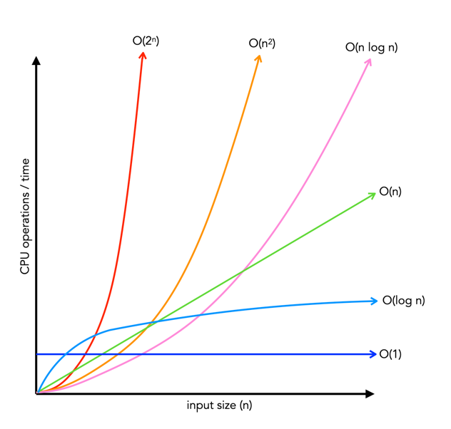
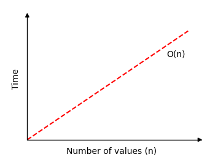

# Big (O) - Time and Space Complexity

In computer science, big O notation is used to describe algorithms according to how fast they run (time complexity) or how much space they take (space complexity) as the input size grows.

**Technical Definition: Big O** is a mathematical notation that describes the limiting behavior of a functio when the argument tends towards a particular value or infinity

**Why Do we need Big O?** Big O notation helps us understand how the performance of an algorithm changes as the size of the input grows, providing a simple way to compare and analzse different algorithms' efficiency

**Time Complexity:** describes the amount of time necessary to execute an algorithms

**Space Complexity:** describes amount of memory or space utilized by an algorithm/program

**Both** - asymptotically




# Big (O) - Linear Example

Let's say we are given a problem where we have a list of `N` numbers (unkown length). We do not know what numbers are in the list.

We are asked to use code to find and return "`True`" if the number `2` is in the list. And if the number is not in the list we return "`False`".

Our solution could be to go through every position in the list and check if the number at that position is equal to `2`. 

Our list is `[3, 10, 2, 7]`

```
For number in list:
    if number == 2:
        return True
    else:
        continue
return False
```



To loop through the entire list of N numbers, and make sure that `2` is or is not in the list, it would take `N` time. We need to check every number in the list once. Making this solution `O(N)` - linear time. The longer the list, (the bigger N is), the longer it would take. 

\* It is important to note that we are talking about the **worst case scenario** here. 

Our number 2 could be at the beginning of the list, which would make it constant time O(1), but 2 could also be at the end of our list. This means we would need to iterate over our entire list of N numbers. This would then take N time to find 2 at the end of the list. 

# Big (O) - Reference Chart


# Big (O) Summary

Fastest ---> Slowest

| Time Complexity | Description | Example |
|-----------------|-------------|---------|
| O(1) - Constant | Time taken remains constant regardless of input size. | Accessing an element in an array by index. |
| O(log N) - Logarithmic | Time taken increases logarithmically as the input size grows. Operations are typically halved at each step. Time increases linearly as N goes up exponentially. | Binary search in a sorted array. |
| O(N) - Linear | Time taken increases proportionally to the size of the input. If N doubles, time taken doubles | Finding an item in an unsorted list. |
| O(N log N) - Linearithmic | Time taken increases in a linearithmic manner, often seen in divide and conquer algorithms | Merge sort or quicksort. |
| O(N^2) - Quadratic | Time taken increases quadratically as the input size grows. Each element needs to be compared to every other element (nested loops). | Bubble sort or selection sort. |
| O(2^N) - Exponential | Time taken doubles with each addition to N, leading to rapidly growing execution times. | Finding all subsets of a set. |
| O(N!) - Factorial | Time taken increases factorially with each increase in input size, leading to extremely slow execution times. | Solving the traveling salesman problem exhaustively. |
